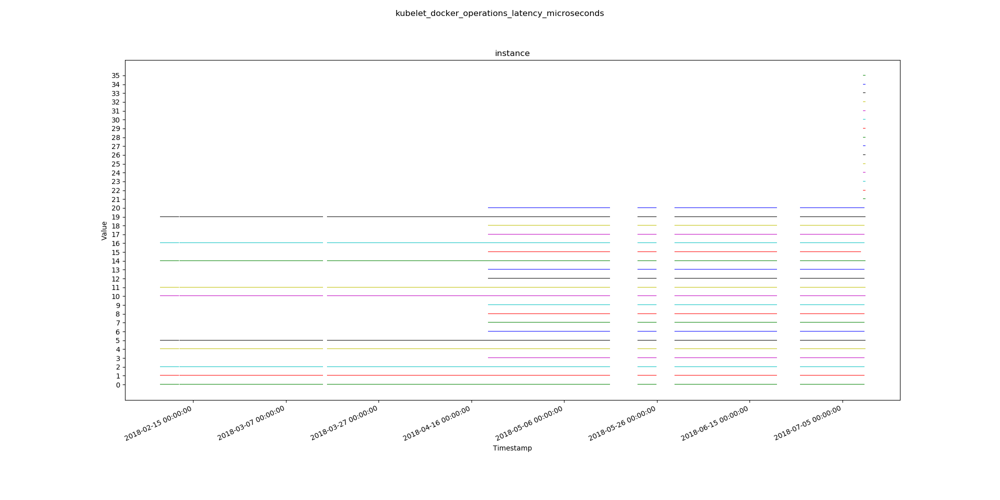

# Data Science on Prometheus Metrics
## **The Metrics**
#### Anatomy of Metrics
For more information, visit https://prometheus.io/docs/concepts/metric_types/

Gauge Metric for a given target:
  * a time series

Counter Metric for a given target:
* a monotonically increasing time series

Histogram Metric for a given target:
* *a collection of bucket time series* -  n buckets in the histogram correspond to n time series. the +Inf bucket time series is the same as the count time series.
* *a count time series* -
a cumulative count of all observations we have seen thus far
* *a sum time series* - a cumulative sum of all observations we have seen thus far

Summary Metric for a given target:
* *quantile time series* - there are n quantiles corresponding to n time series
* *count time series* - a cumulative count of all observations we have seen thus far
* *sum time series* - a cumulative sum of all observations we have seen thus far

#### Key Insights on Metrics
1. The value of a counter is useless - the instantaneous value of a counter is dependent on when Prometheus decides to reset the counter. it is often not indicative of the state of the system. Counters are only useful when we look at how they change over time. For this reason, when we talk about a counter we will automatically preprocess the counter into a difference series where difference(t) = raw(t) - raw(t-1)
2. The metrics are received and stored in the form of packets. All quantile packets are stored in a quantile folder, all count packets in a count folder, etc. We parse these packets and reformat them into dictionaries for each time series type and metric. The key refers to the metadata (target info and metric contents labels) and the value is a pandas dataframe with timestamp and value for each unique metadata configuration. Essentially each key-value pair represents a single incoming time series. For more information, check out [this notebook]()

## **The Metadata**

A given time series is assigned a unique metadata label configuration which includes user-specified and default labels. We used some basic visualization techniques for metadata analysis including graphing and dimensionality reduction.

One of the default labels that occurs in every metric and metadata packet is the instance. The instance is an ip which corresponds to the scraped target. However, these ip addresses are refreshed over time. We can see this as new instances pop up every once in a while.

## **Forecasting**
#### Exponential Smoothing
kubelet_docker_operation_latency_microseconds_quantile

#### ARIMA Modelling

#### Prophet Modelling

#### Fourier Extrapolation

#### Further Research
RNNs (LSTMs)

## **Anomaly Detection Decision Rules**

## **Results**
Comparing Prophet and Fourier

## **Conclusion**
